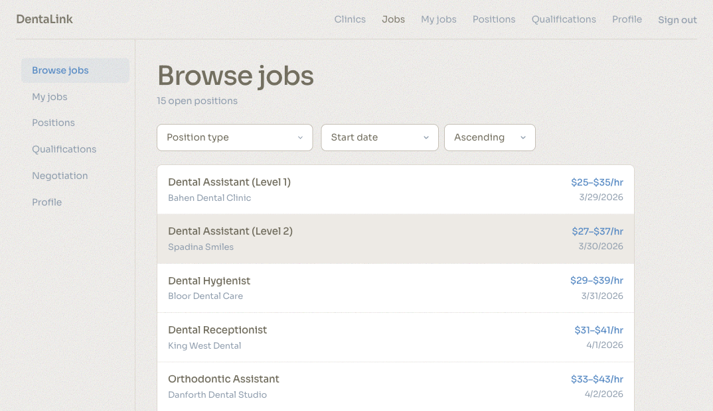
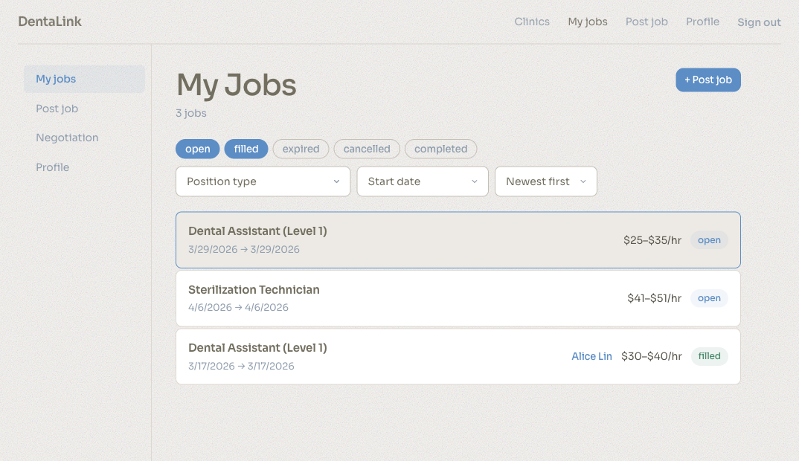
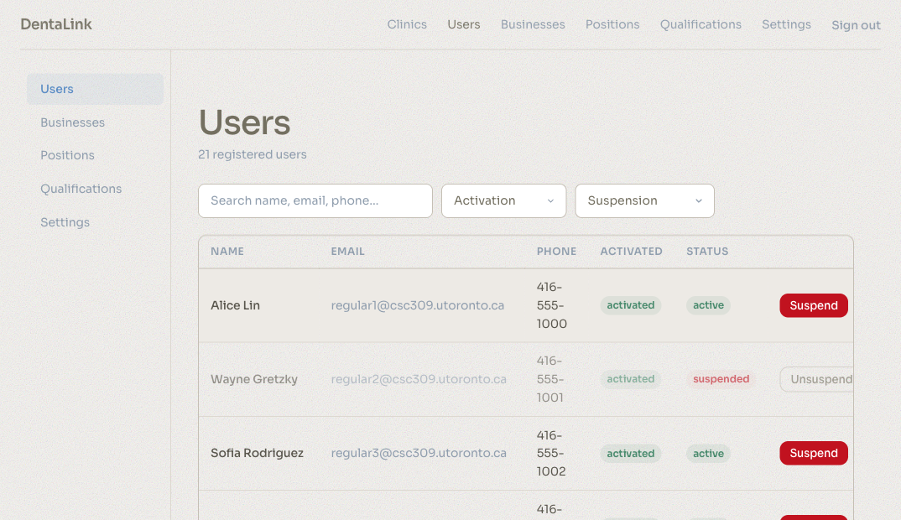
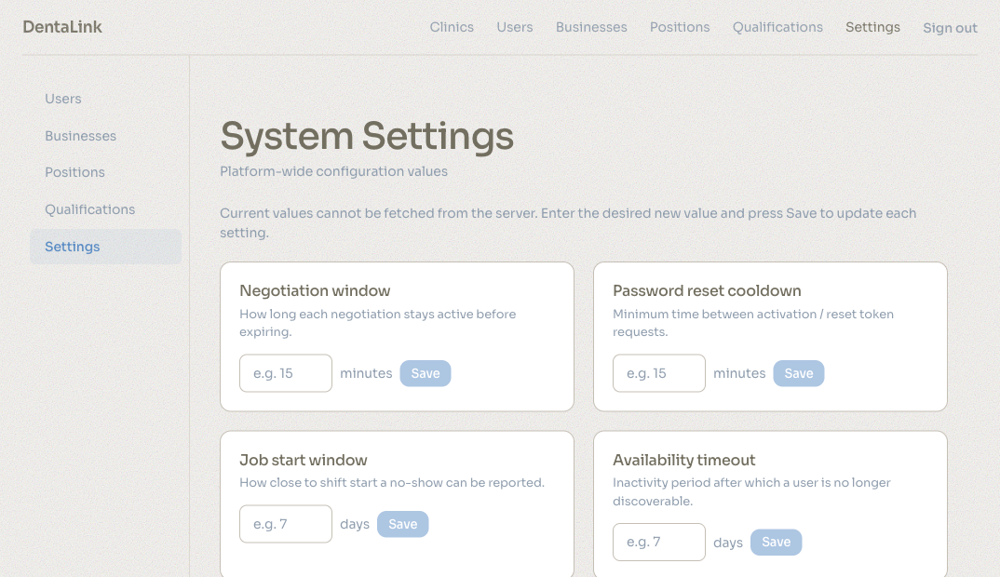
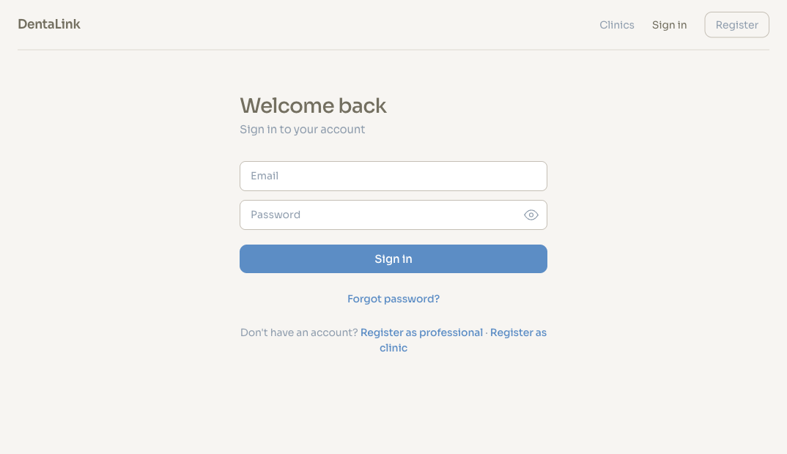
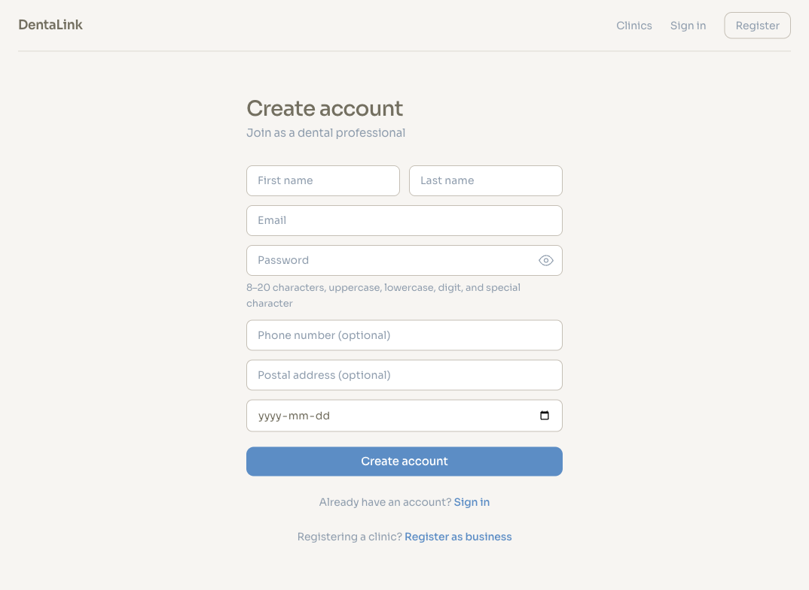

# DentaLink - [Live Website Here](https://dentalink-production-ceda.up.railway.app/)

A real-time dental staffing platform connecting qualified professionals with clinics that need them. Built with React, Express.js, Prisma, and Socket.IO.


## Features

### For dental professionals
- Browse open shifts with filtering by position type, salary range, and start date
- Manage qualifications and upload credential documents for admin review
- Express interest in jobs and receive invitations from clinics
- Real-time negotiation chat with 15-minute time-boxed windows




### For dental clinics
- Post shifts with position type, salary range, and time window
- Browse discoverable candidates filtered by approved qualifications
- Invite candidates and track mutual interest
- Negotiate terms in real time and confirm hires



### For platform administrators
- Manage users (suspend/unsuspend) and businesses (verify/unverify)
- Review and approve qualification submissions
- Configure system settings: negotiation window, reset cooldown, job start window, availability timeout
- Manage position types




### Public pages
- Browse verified dental clinics with search and sorting
- View clinic profiles with location map, contact info, and open positions


### Authentication
- JWT-based auth with role-dependent dashboards
- Account activation via email token
- Password reset flow
- Registration for both professionals and clinics




## Tech stack

| Layer | Technology |
|-------|-----------|
| Frontend | React 18, TypeScript, Vite, React Router |
| Backend | Express.js, Prisma ORM, SQLite |
| Real-time | Socket.IO (WebSocket) |
| Auth | JWT (JSON Web Tokens) |
| Maps | Leaflet + OpenStreetMap |
| Security | Helmet, express-rate-limit, Zod validation |

## Getting started

### Prerequisites
- Node.js 18+
- npm

### Installation

```bash
# install root dependencies
npm install

# install backend dependencies and set up database
cd backend
npm install
npx prisma generate
npx prisma db push
npx prisma db seed

# install frontend dependencies
cd ../frontend
npm install
```

### Environment

Create `backend/.env`:
```
JWT_SECRET=your-secret-key-here
FRONTEND_URL=http://localhost:5173
NODE_ENV=development
```

### Running locally

```bash
# start backend (port 3000)
cd backend
npm start

# start frontend (port 5173)
cd frontend
npm run dev
```

### Seed accounts

| Role | Email pattern | Password |
|------|--------------|----------|
| Regular user | `regular1@csc309.utoronto.ca` ... `regular20@csc309.utoronto.ca` | `Password123!` |
| Business | `business1@csc309.utoronto.ca` ... `business10@csc309.utoronto.ca` | `Password123!` |
| Admin | `admin1@csc309.utoronto.ca` | `Password123!` |

## Project structure

```
.
├── backend/
│   ├── prisma/          # schema, migrations, seed
│   ├── src/
│   │   ├── config/      # environment configuration
│   │   ├── controllers/ # route handlers
│   │   ├── middleware/   # auth, validation, rate limiting, upload
│   │   ├── routes/       # express route definitions
│   │   ├── services/     # business logic
│   │   └── validators/   # zod schemas
│   └── uploads/          # user-uploaded files (avatars, resumes, docs)
├── frontend/
│   └── src/
│       ├── components/   # reusable UI components
│       ├── contexts/     # React context providers (auth, negotiation)
│       ├── pages/        # page-level components by role
│       └── utils/        # API client, helpers
└── docs/
    └── screenshots/      # application screenshots
```

## Security

- Rate limiting on all endpoints (tiered by sensitivity)
- Input validation with Zod schemas on every route
- Centralized secret management (no hardcoded fallbacks)
- Helmet security headers
- File upload size limits
- Socket.IO per-connection message rate limiting
